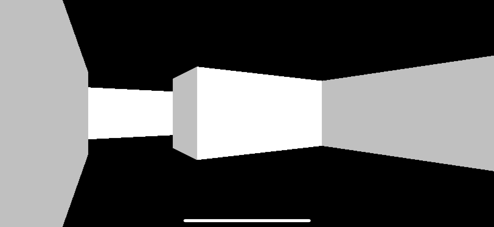
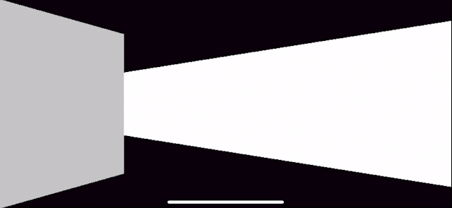

### About

I was fascinated by the [tutorial](https://github.com/nicklockwood/RetroRampage) of Nick Lockwood, where he 
implemented old school game engine from scratch in pure Swift, and I've done my simple raycasting engine. You can walk, rotate, and collide with the walls.
While implementing it, I learned a ton about computer graphics and game engines. In this project, all work is done on the CPU.

### Installation

1. Download the `main` branch.
2. Set Bundle ID.
3. Launch on your device or simulator.
